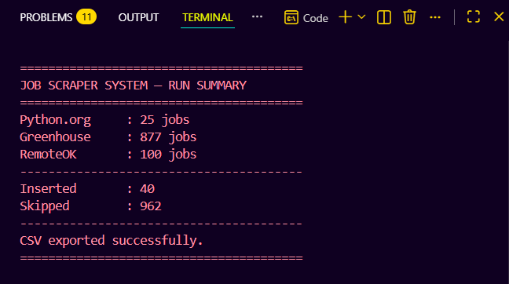
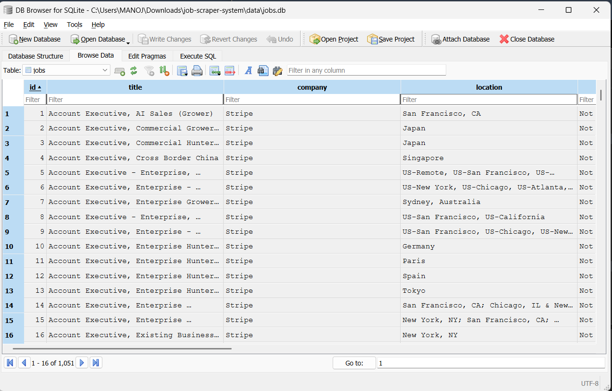
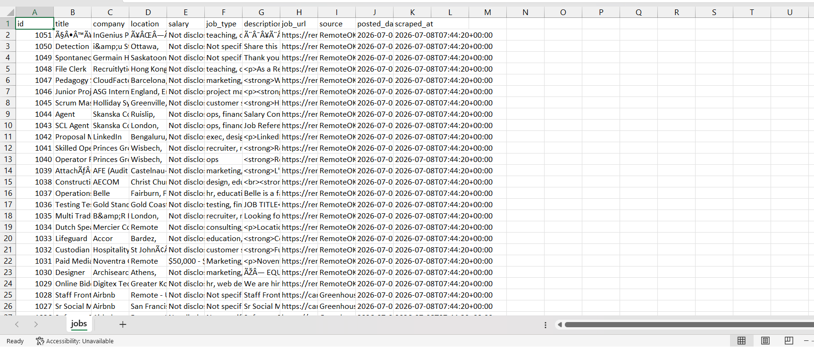

# Job Scraper System

A production-inspired Python application that aggregates job listings from multiple sources, normalizes the data into a common schema, removes duplicates using SQLite, and exports the results to CSV.

Built as a portfolio project to demonstrate real-world scraping architecture: reusable base classes, proper error handling, retries, logging, and a clean separation between scraping, storage, and export layers.

---

## Overview

The system pulls job listings from three sources with two different data-access strategies:

| Source | Method | Why |
|---|---|---|
| [Python.org Jobs](https://www.python.org/jobs/) | HTML scraping (`requests` + `BeautifulSoup`) | No public API — a real HTML page |
| [Greenhouse](https://www.greenhouse.io/) job boards | Public JSON API | Official, documented, no scraping needed |
| [RemoteOK](https://remoteok.com/) | Public JSON API | Official, documented, no scraping needed |

All three sources are normalized into one shared schema, deduplicated by URL, and stored in a single SQLite database — regardless of whether the underlying source returned HTML or JSON.

---

## Data Flow

```text
Python.org (HTML)
        │
Greenhouse (JSON API)
        │
RemoteOK (JSON API)
        ▼
Normalize Job Data
        ▼
Remove Duplicates
        ▼
SQLite Database
        ▼
CSV Export
```

## Features

- **Multi-source scraping** with a shared, reusable `BaseScraper` class
- **Consistent job schema** across every source (title, company, location, salary, job type, description, URL, source, posted date)
- **Duplicate detection** via a `UNIQUE` constraint on `job_url` — a job appearing on two sources is stored once
- **SQLite storage** with parameterized queries, commit/rollback handling, and no ORM overhead
- **CSV export** via pandas, with correct handling of commas/quotes/newlines in fields
- **Retry logic** with configurable attempts and delay for flaky network conditions
- **Centralized logging** to both console and `logs/scraper.log`
- **Easy to extend** — adding a new job source means writing one new scraper class and adding one line to `main.py`
- **Automated unit tests** using `pytest`

---

## Folder Structure

```
job-scraper-system/
│
├── scrapers/
│   ├── __init__.py
│   ├── base_scraper.py          # Shared HTTP fetch, retry, and helper logic
│   ├── python_org_scraper.py    # HTML scraper for python.org/jobs
│   ├── greenhouse_scraper.py    # JSON API scraper for Greenhouse boards
│   └── remoteok_scraper.py      # JSON API scraper for RemoteOK
│
├── database/
│   ├── __init__.py
│   ├── db.py                    # create_database, insert_job, fetch_all_jobs
│   └── schema.sql               # SQLite schema for the jobs table
│
├── exporter/
│   ├── __init__.py
│   └── csv_exporter.py          # Exports stored jobs to CSV via pandas
│
├── utils/
│   ├── __init__.py
│   ├── logger.py                # Centralized logging config
│   ├── config.py                # URLs, paths, timeouts, retries
│   └── helpers.py                # Text cleaning, date/salary normalization
│
├── data/                        # SQLite database file lives here
├── exports/                     # jobs.csv lives here
├── logs/                        # scraper.log lives here
├── tests/                       # Unit tests
│
├── main.py                      # Entry point: scrape → store → export
├── requirements.txt
├── README.md
├── LICENSE
└── .gitignore
```

---

## Tech Stack

- **Python 3.12**
- `requests` — HTTP requests with retries and timeouts
- `beautifulsoup4` + `lxml` — HTML parsing
- `pandas` — CSV export
- `sqlite3` (standard library) — storage
- `logging`, `typing`, `contextlib`, `pathlib`, `csv` (all standard library)
- `pytest` — Unit testing

No frameworks, no async, no Docker, no ORM — deliberately kept simple and readable.

---

## Installation

```bash
git clone https://github.com/Manojseervi0/job-scraper-system.git
cd job-scraper-system

python3 -m venv venv
source venv/bin/activate        # On Windows: venv\Scripts\activate

pip install -r requirements.txt
```

---

## How to Run

```bash
python main.py
```

This will:

1. Create `data/jobs.db` if it doesn't already exist.
2. Run all three scrapers.
3. Insert new jobs into SQLite, skipping any duplicates by URL.
4. Export every stored job to `exports/jobs.csv`.
5. Print a summary like:

```
========================================
JOB SCRAPER SYSTEM — RUN SUMMARY
========================================
Python.org     : 25 jobs
Greenhouse     : 876 jobs
RemoteOK       : 100 jobs
----------------------------------------
Inserted       : 1001
Skipped        : 0
----------------------------------------
CSV exported successfully.
========================================
```

Logs for every run are written to `logs/scraper.log`.

---

## Screenshots

### Project Execution



### SQLite Database



### Exported CSV


---

## Future Improvements

- Add a lightweight CLI (`argparse`) to run individual scrapers or set a custom output path
- Add Docker support
- Add GitHub Actions for automated testing
- Add a `--schedule` flag to run on a timer instead of once
- Add a simple Streamlit dashboard to browse and filter `jobs.db` visually
- Add more Greenhouse companies or additional job sources (e.g. Lever, Workable)
- Add pytest-based CI via GitHub Actions

---
## Key Concepts Demonstrated

- Object-Oriented Programming (OOP)
- Abstract Base Classes & Inheritance
- Web Scraping with BeautifulSoup
- REST API Integration
- SQLite Database Design
- Context Managers
- Logging
- Retry Mechanism
- Data Normalization
- CSV Export with Pandas
- Unit Testing with Pytest

## License

MIT — see [LICENSE](LICENSE).
